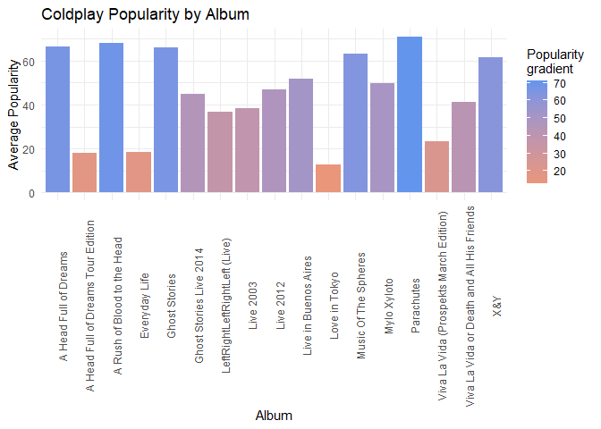

``` r
rm(list = ls()) # Clean your environment:
gc() # garbage collection - It can be useful to call gc after a large object has been removed, as this may prompt R to return memory to the operating system.
```

    ##          used (Mb) gc trigger (Mb) max used (Mb)
    ## Ncells 512156 27.4    1141181   61   644242 34.5
    ## Vcells 875739  6.7    8388608   64  1635161 12.5

``` r
library(tidyverse)
```

    ## ── Attaching packages ─────────────────────────────────────── tidyverse 1.3.2 ──
    ## ✔ ggplot2 3.4.0     ✔ purrr   1.0.1
    ## ✔ tibble  3.1.8     ✔ dplyr   1.1.0
    ## ✔ tidyr   1.3.0     ✔ stringr 1.5.0
    ## ✔ readr   2.1.4     ✔ forcats 0.5.2
    ## ── Conflicts ────────────────────────────────────────── tidyverse_conflicts() ──
    ## ✖ dplyr::filter() masks stats::filter()
    ## ✖ dplyr::lag()    masks stats::lag()

``` r
list.files('code/', full.names = T, recursive = T) %>% .[grepl('.R', .)] %>% as.list() %>% walk(~source(.))
```

    ## Rows: 232 Columns: 15
    ## ── Column specification ────────────────────────────────────────────────────────
    ## Delimiter: ","
    ## chr   (2): name, album_name
    ## dbl  (11): duration, popularity, acousticness, danceability, energy, instrum...
    ## lgl   (1): explicit
    ## date  (1): release_date
    ## 
    ## ℹ Use `spec()` to retrieve the full column specification for this data.
    ## ℹ Specify the column types or set `show_col_types = FALSE` to quiet this message.
    ## Rows: 1468 Columns: 14
    ## ── Column specification ────────────────────────────────────────────────────────
    ## Delimiter: ","
    ## chr   (2): name, album
    ## dbl  (11): duration_ms, popularity, danceability, energy, loudness, speechin...
    ## date  (1): release_date
    ## 
    ## ℹ Use `spec()` to retrieve the full column specification for this data.
    ## ℹ Specify the column types or set `show_col_types = FALSE` to quiet this message.

# Loading in Data

Each band’s data set of their album history is individually stored in
the *data* folder. the necessary changes to the code are made in the
*code/data_load.R* file.

``` r
source("code/data_load.R")
```

    ## Rows: 232 Columns: 15
    ## ── Column specification ────────────────────────────────────────────────────────
    ## Delimiter: ","
    ## chr   (2): name, album_name
    ## dbl  (11): duration, popularity, acousticness, danceability, energy, instrum...
    ## lgl   (1): explicit
    ## date  (1): release_date
    ## 
    ## ℹ Use `spec()` to retrieve the full column specification for this data.
    ## ℹ Specify the column types or set `show_col_types = FALSE` to quiet this message.
    ## Rows: 1468 Columns: 14
    ## ── Column specification ────────────────────────────────────────────────────────
    ## Delimiter: ","
    ## chr   (2): name, album
    ## dbl  (11): duration_ms, popularity, danceability, energy, loudness, speechin...
    ## date  (1): release_date
    ## 
    ## ℹ Use `spec()` to retrieve the full column specification for this data.
    ## ℹ Specify the column types or set `show_col_types = FALSE` to quiet this message.

``` r
c <- coldplay
m <- metallica
```

# Battle of the Tunes

Although these bands are from two completely different genres, they are
both well-known. The albums are split between live performances and
album performances. Each song is rated by popularity and this is
combined to indicate if live or album performances are better.

``` r
source("code/num.R")
cold <- count_performance_table(coldplay)
metal <- count_performance_table(metallica)
cold
```

    ##   Performance_Type Count Popularity Duration Danceability Instrumentalness
    ## 1            Album   141      47.15   243.23         0.43             0.26
    ## 2             Live    91      37.49   291.75         0.33             0.13
    ##   Energy
    ## 1   0.56
    ## 2   0.72

``` r
metal
```

    ##   Performance_Type Count Popularity Duration Danceability Instrumentalness
    ## 1            Album   672      31.81   313.61         0.41             0.42
    ## 2             Live   796      19.88   350.54         0.29             0.29
    ##   Energy
    ## 1   0.80
    ## 2   0.88

It is clear that Metallica has much more songs/albums than Coldplay, but
this is mainly due to their numerous Remasters that contains repetitions
of the same song. However, Coldplay is the more popular band, across
their albums and live performances, compared to Metallica. Both bands
seem to perform their songs longer in front of a crowd, compared to the
album duration. As one would imagine, the energy and instrumentalness is
dominated by Metallica. This shouldn’t come as a surprise, as this is a
comparison between a heavy metal band and an indie band. The
danceability is quite similar between the two bands, and this done come
as a surprise.

I have produced a graph similar to what my colleague has done, but for
Coldplay only - since they have done this for Metallica. However, I have
not done a Boxplot, but rather a bar graph, as can be seen below.

``` r
p <- coldplay_pop_album(coldplay)
p
```



This provides the average popularity for each album, which can be
compared to Metallica’s.

# Conclusion

In conclusion, these two bands compare well with duration, danceability
and instrumentalness. However, these bands differ in terms of the amount
of albums/liver performances and popularity. Coldplay is more much more
modern than Metallica and music taste will change over time. Thus,
utilising Spotify data base, there will be bias towards Coldplay.
